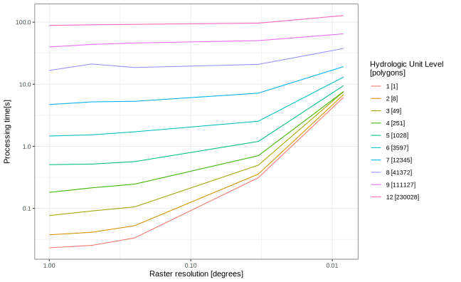
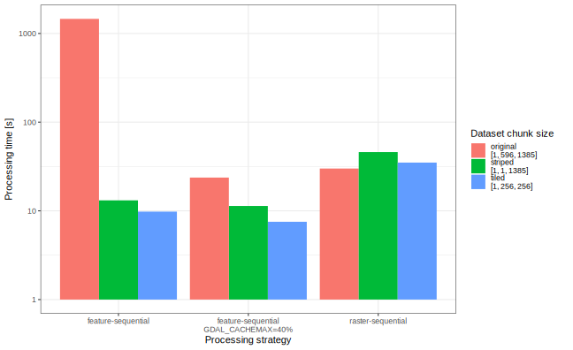

Performance
===========

Overview
--------

Typically, ``exactextract`` computation time is largely consumed by, in order of decreasing importance:

- raster I/O, for compressed rasters
- pixel area intersection calculation
- statistics computation

The following graph shows the effect of increasing raster size and polygon complexity on processing time for one example task, in which the population is calculated of all watersheds in Africa.
Watershed boundaries are taken from the `HydroBASINS <https://www.hydrosheds.org/products/hydrobasins>`__ dataset, which provides polygons at 12 levels of hierarchy ranging from one single polygon with 68k vertices to 230,000 polygons with a total of 16 million vertices.
Population is taken from the `Gridded Population of the World <https://sedac.ciesin.columbia.edu/data/collection/gpw-v4>`__, which is offered at resolutions from 1 degree to 30 arc seconds.

With relatively few polygons (hydrologic levels 1-6, up 3500 polygons) processing time is largely governed by the resolution of the population raster.
As the number of polygons increases, the resolution of the population raster becomes less significant. 
At hydrologic levels 9 and 12 (approximately 1 million and 2 million polygons, respectively), increasing the resolution by a factor of 120 increases runtime by only 45%.

.. _performance-processing-strategies:

Processing strategies
---------------------

``exactextract`` offers two processing strategies, either of which may be advantageous depending on the specifics of the inputs.

The "feature sequential" strategy
^^^^^^^^^^^^^^^^^^^^^^^^^^^^^^^^^

In the ``feature-sequential`` strategy (the default), ``exactextract`` iterates over the features one at a time, reads the corresponding pixels from each raster, and computes the summary operations.

This strategy is the most efficient from a memory consumption perspective. The entire vector dataset does not need to be read into memory at once, and statistics for each feature can be flushed to disk before the next feature is read. However, this strategy may be inefficient if the order of features causes the same raster blocks to be read and decompressed multiple times.

If GDAL is being used to read raster data, increasing the size of the GDAL block cache through the ``GDAL_CACHEMAX`` environment variable may improve performance. More information is available in the `GDAL documentation <https://gdal.org/user/configoptions.html>`__.

The "raster sequential" strategy
^^^^^^^^^^^^^^^^^^^^^^^^^^^^^^^^

In the ``raster-sequential`` strategy, ``exactextract`` iterates over chunks of the raster, finds corresponding features from the vector layer, and updates the summary operations. This guarantees that raster pixels are read only once, which can be useful if network access or compression make the read process slow. However, this strategy requires all vector features and their associated statistics to be kept in memory for the duration of processing. It also causes features spanning multiple chunks to be visited multiple times, which is inefficient.

Raster chunk size effects
-------------------------

Many rasters found "in the wild" are compressed into chunks consisting either of a single/few scanlines, or of tiles of 256 or 512 pixels.
Occasionally, rasters are compressed with much larger chunks, in some cases consisting of the entire dataset.
These rasters may cause the ``feature-sequential`` strategy to perform very poorly.

An example dataset that uses a large chunk size is the `NClimGrid <https://www.ncei.noaa.gov/access/metadata/landing-page/bin/iso?id=gov.noaa.ncdc:C00332>`__ dataset of monthly mean temperatures.
It is distributed as single netCDF file covering the continental United States at 2.5-arc minute resolution (1385x596) at 1555 timesteps.
Each 1385x596 grid is compressed as a single chunk, meaning that reading any window of data requires decompressing the entire grid for that timestep.
This leads to poor performance for the ``feature-sequential`` strategy, because each the entire raster must be decompressed when each feature is processed.
As an example, computing the mean temperature across all timesteps for each of Florida's 67 counties requires approximately 24 minutes:

.. code-block:: bash

   time exactextract -p tl_2023_fl_county.shp -r nclimgrid_tavg.nc -s mean -o fl_mean_tmp.csv --include-col GEOID
   # 1444.99s user 14.16s system 99% cpu 24:20.21 total

Rechunking inputs
^^^^^^^^^^^^^^^^^

Performance can be greatly improved by rechunking the input raster to such that each chunk contains only a single scanline:

.. code-block:: bash

   nccopy nclimgrid_tavg.nc -d4 -s -c "time/1,lat/1,lon/1385" nclimgrid_tavg_rechunk.nc
   
or a 256x256 tile:

.. code-block:: bash

   nccopy nclimgrid_tavg.nc -d4 -s -c "time/1,lat/256,lon/256" nclimgrid_tavg_tiled.nc

Rechunking using scanlines improves the performance dramatically, reducing the runtime by over two orders of magnitude, from 24 minutes to 13 seconds.
Rechunking using tiles gives a further improvement to 10 seconds.

Selecting a different strategy
^^^^^^^^^^^^^^^^^^^^^^^^^^^^^^

Alternatively, the ``raster-sequential`` processing strategy can be used.
Performance in this case is not as good as the ``feature-sequential`` strategy with rechunked inputs, but no rechunking is required.

Increasing the GDAL block cache size
^^^^^^^^^^^^^^^^^^^^^^^^^^^^^^^^^^^^

If the entire raster can fit into memory, then increasing the value of the ``GDAL_CACHEMAX`` environment variable may also allow the dataset to be processed efficiently.
With a sufficiently large block cache, all 1555 chunks will be read when processing the first polygon, and they will remain in memory for rapid access when processing subsequent features.

In this case, generously setting ``GDAL_CACHEMAX=40%`` allows the dataset to be processed using hte ``feature-sequential`` strategy in 24 seconds on the original dataset.

The following figure summarizes the timings discussed above.

.. note::

   The chunk size of a raster can be determined with ``gdalinfo`` or format-specific utilities such as ``ncdump``.

Memory usage
------------

``exactextract`` limits the size of raster chunks that may be loaded into memory with a parameter called ``max_cells_in_memory``.
If the feature is larger than ``max_cells_in_memory``, it will be processed piecewise, which may be inefficient for complex features.
With the ``raster-sequential`` processing strategy, this controls the size of the feature chunks.
With the ``feature-sequential`` processing strategy, this limits the number of cells that may be read for a given feature.

If ``max_cells_in_memory`` is too low, the same features will be traversed multiple times.
Still, increasing the memory available to ``exactextract`` may actually worsen performance.
The default value of 30 million seems to be reasonable from empirical testing.
